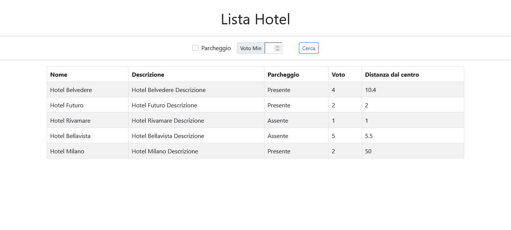

# PHP Hotel

## Descrizione

Piccolo progetto PHP per la gestione e visualizzazione di una lista di hotel.

L'applicazione:
- Mostra una tabella con i dati di diversi hotel.
- Permette il **filtraggio** tramite:
  - Disponibilità di **parcheggio**.
  - **Voto minimo** degli hotel.
- Utilizza **Bootstrap 5** per lo stile della tabella e del form.

---

## Tecnologie

- **PHP** (core backend)
- **HTML5**
- **Bootstrap 5** (stile responsive e componenti)

---

## Struttura Funzionale

- Array `$hotels` che contiene tutti i dati degli hotel.
- **Form** con metodo GET:
  - Checkbox per filtrare solo hotel con parcheggio.
  - Input numerico per impostare il voto minimo.
- **Tabella** Bootstrap dinamica che mostra i dati degli hotel.
- Filtraggio dinamico in base ai parametri GET ricevuti.

---

## Come Funziona

1. All'avvio, senza filtri, vengono mostrati **tutti** gli hotel.
2. È possibile selezionare:
   - **Parcheggio**: mostra solo gli hotel che hanno un parcheggio.
   - **Voto minimo**: mostra solo hotel con voto uguale o superiore al valore inserito.
3. È possibile combinare **entrambi i filtri**.
4. I dati sono stampati in una tabella responsive Bootstrap.

---

## Esempi di Uso

- Nessun filtro: visualizza tutti gli hotel.
- Solo parcheggio: visualizza hotel con parcheggio disponibile.
- Solo voto minimo: visualizza hotel con voto superiore o uguale a quello specificato.
- Entrambi: visualizza hotel con parcheggio e voto sufficiente.

---

## Screenshot

---

## Note

- Se nessun filtro viene applicato, la lista completa degli hotel è visibile.
- Il form mantiene il checkbox selezionato se già flaggato grazie a PHP.
- Gestione del campo `parking` in tabella con testo **Presente** o **Assente**.

---

## Bonus

- ✅ **Filtro combinato** parcheggio + voto minimo.
- ✅ **Stilizzazione** della pagina con Bootstrap.
- ✅ **Mantieni stato** del form dopo la ricerca.

---

